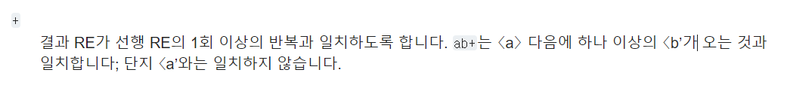
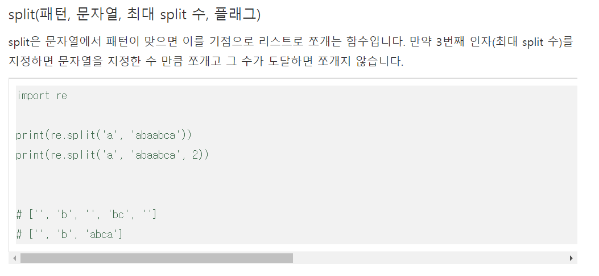

# 프로그래머스 17682 다트 게임

[문제 링크](https://programmers.co.kr/learn/courses/30/lessons/17682)

## 1. 설계 로직

0. 게임 결과가 문자열로 주어지기 때문에 이 문자열을 3세트 게임으로 변환시켜줘야합니다.

   저는 리스트로 나타내기 위해 정규 표현식을 사용했습니다.

   `re.findall()`을 이용할 경우, 정규식과 매치되는 모든 문자열을 리스트 형식으로 리턴해줍니다.

   https://wikidocs.net/80570

   - `[0-9]+`: 숫자인 경우를 의미합니다. `[0-9]`만 할 경우, `10`이 쪼개져서 `1`, `0`으로 리스트에 들어가게 되는데, `[0-9]+`인 경우, 숫자 패턴이 반복될 때까지는 하나의 요소이기 때문에 숫자가 아닌 다른 문자가 등장할 때까지 하나의 요소가 됩니다. 

     (즉, 숫자의 길이와 상관 없이 숫자 하나가 한 묶음으로 들어가게 된다는 것)

     

   - `[^0-9]+`: 숫자가 아닌 경우를 의미합니다.

   

1. game함수를 만들어 점수와 보너스문자를 인자로 넘겨줍니다.

2. game함수는 보너스 점수에 따라 현재 점수를 바꾸고, 옵션에 따라 점수를 갱신해주고 game_score리스트에 담아줍니다.

3. game_score 요소들의 합을 반환합니다.


- 시간복잡도: O(N) 이라고 생각합니다만 .. ~! 정규표현식이 O(N)보다 클 것이라는 말두 있네여 ,, ~! 어렵씀다

  근데 이 문제는 dartResult에 들어오는 값의 길이가 최대 9라 시간적으로 문제가 되진 않을 것 같기두 ,, 함다 ~!

## 2. 코드

```python
import re


def solution(dartResult):
    pluses = re.findall('[^0-9]+', dartResult)
    scores = re.findall('[0-9]+', dartResult)
    game_score = []
    plus_i, score_i = 0, 0
    now_turn = 0
    
    def game(score, plus):
        nonlocal game_score
        
        if plus[0] == 'S':
            total = score
        elif plus[0] == 'D':
            total = score ** 2
        else:
            total = score ** 3
        
        if len(plus) == 2:
            if plus[1] == '*':
                if len(game_score) > 0:
                    game_score[-1] *= 2
                total *= 2
            else:
                total = -(total)
        return total

    for i in range(3):        
        _temp = game(int(scores[i]), pluses[i])
        game_score.append(_temp)
    return sum(game_score)
```


## 3. 후기

```python
import re


def solution(dartResult):
    pluses = re.split('[0-9]', dartResult)
    scores = re.split(r'S|D|T|\*|\#', dartResult)
    
    game_score = []
    plus_i, score_i = 0, 0
    now_turn = 0
    
    def game(score, plus):
        nonlocal game_score
        
        if plus[0] == 'S':
            total = score
        elif plus[0] == 'D':
            total = score ** 2
        else:
            total = score ** 3
        
        if len(plus) == 2:
            if plus[1] == '*':
                if len(game_score) > 0:
                    game_score[-1] *= 2
                total *= 2
            else:
                total = -(total)
        return total
    
    while True:
        if now_turn == 3:
            return sum(game_score)
        
        while scores[score_i] == '':
            score_i += 1
        
        while pluses[plus_i] == '':
            plus_i += 1            
        
        _temp = game(int(scores[score_i]), pluses[plus_i])
        game_score.append(_temp)
        
        score_i += 1
        plus_i += 1
        now_turn += 1
    return
```

- 처음에는 지난 문제에서 풀이했던 방식대로 `re.split`을 사용하여 진행했습니다.

  - 하지만 `re.split`의 경우, 첫 번째 인자에 부합하는 요소가 등장할 경우 공백으로 리스트에 포함하게 되어 리스트 안에 공백 요소가 포함됩니다.

     출처 : https://brownbears.tistory.com/506

    

    게임은 3세트로 구성되어 있기 때문에 while을 사용해서 공백을 pass해줘도 시간 상 문제가 되지 않을 것이라 판단했지만, 찝찝하구 기분이 좋지 않았습니다 ^-^ㅠ

    

    그래서 이러한 공백을 제거하기 위해 고민을 하다가, `findall`을 사용하면 풀린다는 것을 찾았습니다~!

  

- 정규표현식 정리된 글 : https://cheris8.github.io/python/PY-Regex/