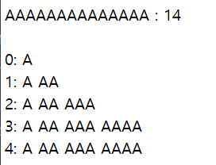
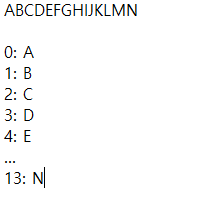

# 프로그래머스 17684 압축

[문제 링크](https://programmers.co.kr/learn/courses/30/lessons/17684)

## 1. 설계 로직

1. 먼저 `dict`에 A-Z를 담아줍니다.

2. 주어진 `msg`를 하나씩 확인하여 해당 문자(혹은 문자열)가 존재하면 그 다음에 등장하는 문자를 하나 붙여줍니다. 이 때 기존 문자에 다음 문자를 붙인 문자열을 `new_word`라고 하고, 해당 `new_word`가 또 존재하면 해당 문자열 뒤의 문자를 하나 더 붙여 `new_word`를 갱신합니다.

   만약 `new_word`가 `dict`에 존재하지 않을 경우 `dict`에 담아주고, 그 다음 문자로 넘어가 2번을 반복합니다.


- 시간복잡도: O(N^2) 
  
  - 문자열이 dict에 존재하는지 확인하기 전 문자열을 만들 때 시간 복잡도가 O(N^2)이고, 확인하는 과정은 O(1)이라서 O(N^2)이라고 생각했습니다.
  
  이라고 생각했는데
  
  승환님과 계산해본 결과
  
  O(N)이었습니다.
  
  이유는 문자열이 같은 문자로 이루어져있을 때를 생각해봤을 때,
  
  
  
  그리고 문자열이 같은 문자로 이루어져있지 않을 때에도,
  
  
  
  O(N)이기 때문입니다.

## 2. 코드

```python
def solution(msg):
    answer = []
    dictionary = {}
    idx = 1
    while idx < 27:
        dictionary[chr(ord('A') + idx - 1)] = idx
        idx += 1

    msg_i = 0
    plus_i = 1
    while True:
        while msg[msg_i:msg_i + plus_i] in dictionary:
            plus_i += 1
            if msg_i + plus_i - 1 > len(msg):
                break
        answer.append(dictionary[msg[msg_i:msg_i + plus_i - 1]])
        if (msg_i + plus_i - 1) > len(msg):
            break
        if msg[msg_i:msg_i + plus_i] not in dictionary:
            dictionary[msg[msg_i:msg_i + plus_i]] = idx
            idx += 1
            msg_i += (plus_i - 1)
            plus_i = 1
    return answer
```


## 3. 후기

```python
tmp = {chr(e + 64): e for e in range(1, 27)}
```
- 다른 사람 중에는 A-Z까지 딕셔너리를 이렇게 짠 사람도 있었고,

```python
myDic = dict(zip("ABCDEFGHIJKLMNOPQRSTUVWXYZ", range(1,27)))
```

- 이렇게 `zip`을 이용한 사람도 있었습니다.

