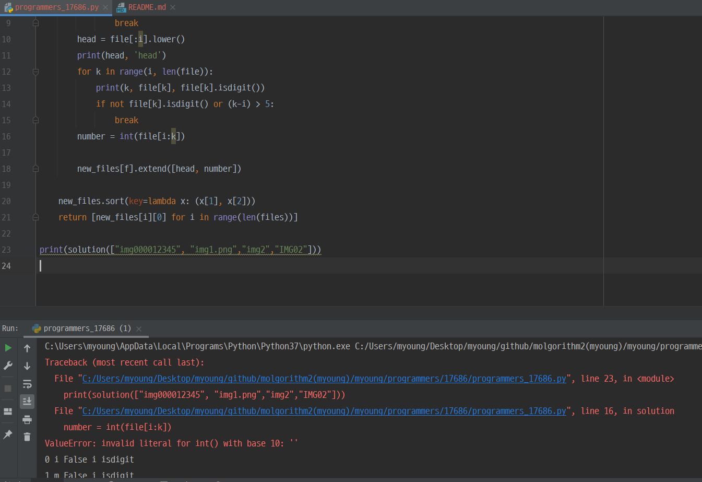

# 프로그래머스 17686 파일명 정렬

[문제 링크](https://programmers.co.kr/learn/courses/30/lessons/17686)

## 1. 설계 로직

0. 파일명 : HEAD, NUMBER 부분을 파싱합니다.
1. 파싱 후,  HEAD에 담긴 문자는 모두 소문자로 만들어주고, NUMBER에 답긴 숫자는 int형으로 바꾸어 [`기존 문자`, `HEAD.lower()`, `int(NUMBER)`] 형태로 만들어줍니다.
2. 이렇게 2차 배열을 만들어, 배열을 sort해줍니다.
   - sort의 첫 번째 순위는 HEAD, 두 번째 순위는 NUMBER가 되게끔 key값을 넣어줍니다. 
   - sort를 하면 HEAD, NUMBER의 우선순위가 같을 때 기존 배열의 순위를 가지고 있기 때문입니다.
3. sort 후 맨 앞의 값(`기존 문자`)만 배열에 담아 보여줍니다.


- 시간복잡도: O(N*(M+logN))입니다. (N은 파일의 갯수, M은 파일명의 길이)

## 2. 코드

```python
def solution(files):
    new_files = [[file] for file in files]
    for f in range(len(files)):
        file = files[f]
        for i in range(len(file)):
            if file[i].isdigit():
                break
        head = file[:i].lower()
        number = file[i:min(i+5, len(file))]
        for k in range(len(number)):
            if not number[k].isdigit():
                number = number[:k]
                break
        new_files[f].extend([head, int(number)])
    new_files.sort(key=lambda x: (x[1], x[2]))
    return [new_files[i][0] for i in range(len(files))]
```


## 3\. 후기

- 파싱하는 과정에서 자꾸 런타임 에러가 나서 눈물 주륵주륵 흘렸습니다 ㅠ 

  근데 어이없게도.. 

  `["img000012345", "img1.png","img2","IMG02"]` 요런 식의 입력이 들어왔을 때 숫자 범위를 제대로 못잡아서 그런 것이어씁니다 .. 흑흑 (인덱스오류 였던 것..)

  