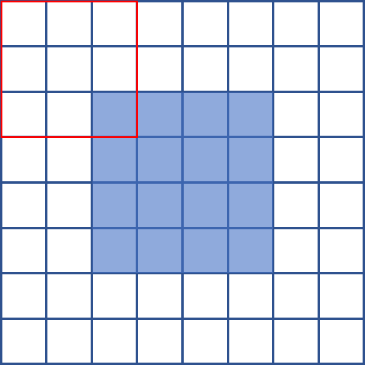

# 프로그래머스 60059 자물쇠와 열쇠

[문제 링크](https://programmers.co.kr/learn/courses/30/lessons/60059)

## 1. 설계 로직

1. 자물쇠의 크기를 키워서 열쇠를 끼워보는 방식으로 접근했습니다.
2. 키의 크기가 3x3이고, 자물쇠의 크기가 4x4일 때 다음과 같이 자물쇠를 (3-1)*2+4 로 크기를 늘립니다.



3. 그리고 키를 90도로 회전시키면서 열 수 있는지 확인합니다.


- 시간복잡도 : O(N^3) 
- key와 lock의 크기가 다를 때, 최대 N^3이 나옵니다.
  

## 2. 코드

```python
def rot(key):
    N = len(key)
    new_key = [[0] * N for i in range(N)]
    for y in range(N):
        for x in range(N):
            new_key[y][x] = key[N - x - 1][y]
    return new_key


def solution(key, lock):
    N = len(key)
    M = len(lock)
    key_len = 0
    lock_len = 0
    for y in range(N):
        for x in range(N):
            if key[y][x] == 1:
                key_len += 1
    for y in range(M):
        for x in range(M):
            if lock[y][x] == 0:
                lock_len += 1

    if key_len < lock_len:
        return False

    if M == N and lock_len == key_len:
        for i in range(4):
            key = rot(key)
            cnt = 0
            for y in range(M):
                for x in range(M):
                    if key[y][x] != lock[y][x]:
                        cnt += 1
                    else:
                        cnt = 0
            if cnt == (M * M):
                return True
        return False

    else:
        big_lock = [[2] * ((N - 1) * 2 + M) for i in range((N - 1) * 2 + M)]
        for y in range(M):
            for x in range(M):
                big_lock[y + N - 1][x + N - 1] = lock[y][x]

        for i in range(4):
            key = rot(key)
            for k in range(len(big_lock) - N + 1):
                for t in range(len(big_lock) - N + 1):
                    open_key = 0
                    cnt = 0
                    for y in range(N):
                        for x in range(N):
                            if key[y][x] != big_lock[y + k][x + t]:
                                cnt += 1
                                if key[y][x] == 1 and big_lock[y + k][x + t] == 0:
                                    open_key += 1
                            elif key[y][x] == 1 and big_lock[y + k][x + t] == 1:
                                cnt = 0
                            else:
                                cnt += 1
                    if cnt == (N * N) and open_key == lock_len:
                        return True
    return False
```


## 3. 후기

- 열쇠를 어떻게 확인할지 고민을 많이한 문제입니다.

